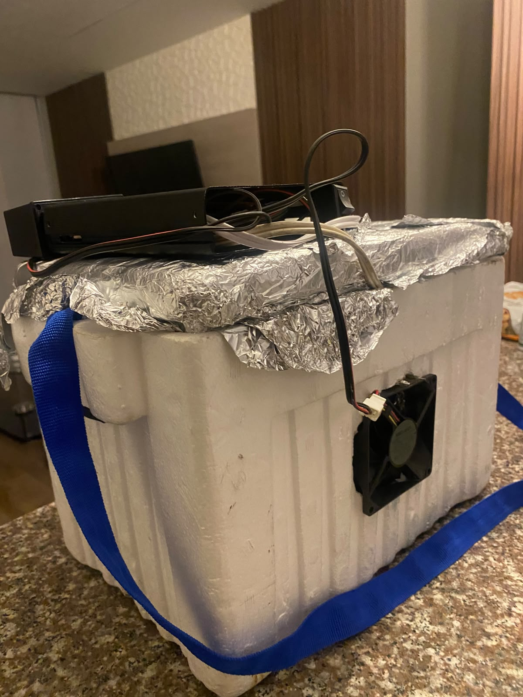
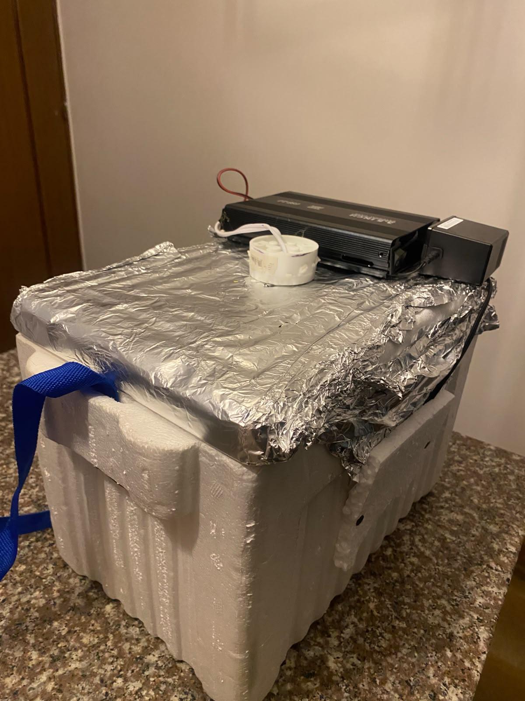
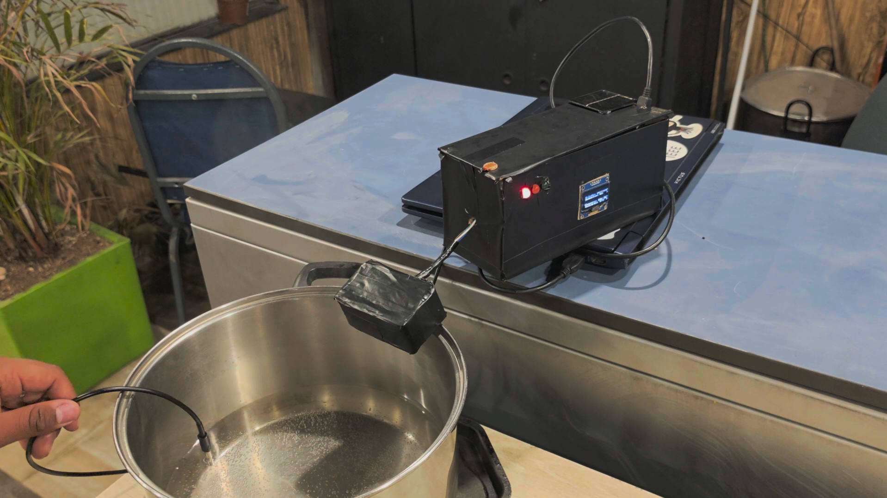
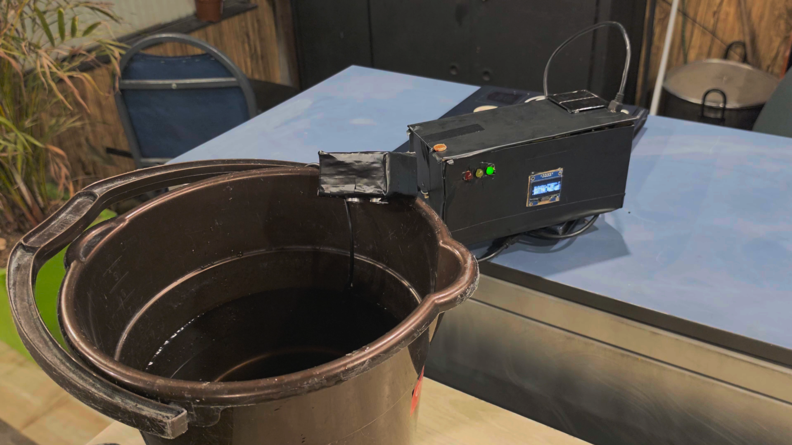
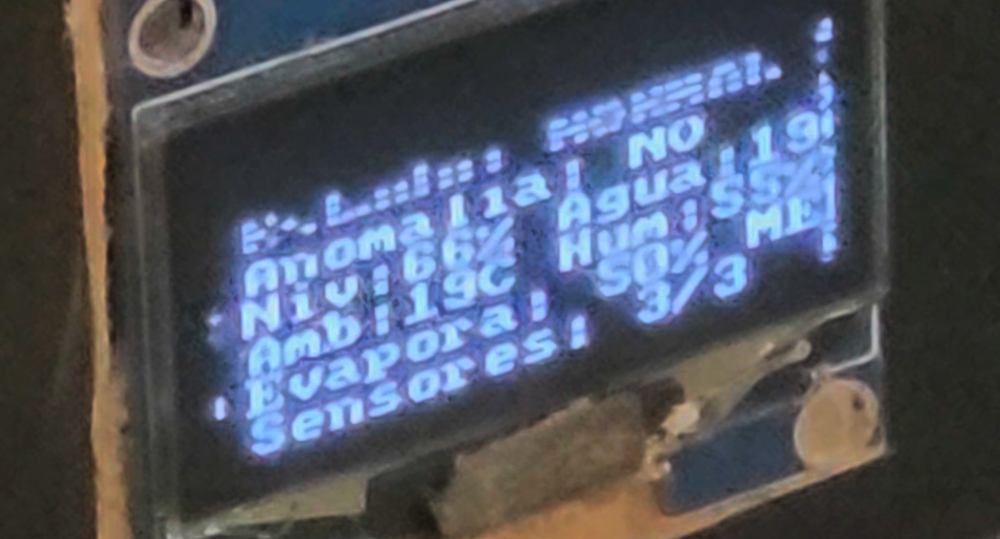
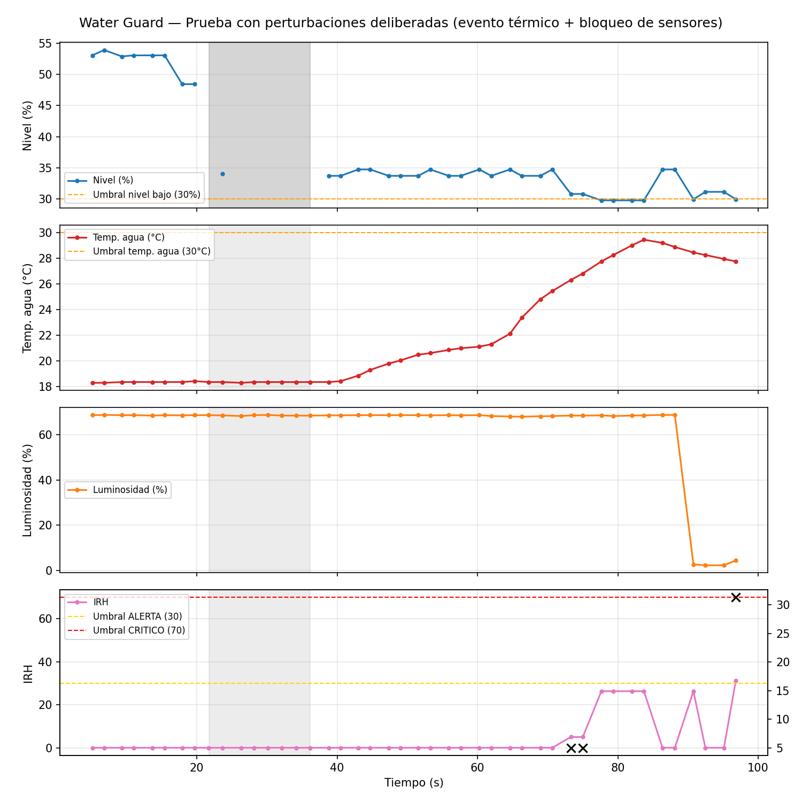

# 💧 WaterGuard v7
Sistema de monitoreo inteligente de tanques de agua basado en Arduino. Combina lecturas de nivel, temperatura, humedad, luz ambiente y luminosidad para calcular un **Índice de Riesgo Hídrico (IRH)** y una **probabilidad de evaporación** en tiempo real, detectar anomalías con una ventana móvil estadística y avisar al usuario mediante LEDs, buzzer y pantalla OLED.

**Universidad de La Sabana** — Facultad de Ingeniería, Ingeniería Informática
**Curso:** IoT (Internet of Things)
**Integrantes:** Juan José Riaño Zabaleta · Santiago Peña Beltrán

> 📖 **¿Quieres profundizar?** Toda la documentación extendida —incluyendo el análisis offline con K-Means, el detalle de las fórmulas del IRH y de la probabilidad de evaporación, y el diseño del cableado— está en la **[Wiki del repositorio](../../wiki)**.

---

## 🧩 Metodología de desarrollo

### 1. Análisis del problema y del entorno
El punto de partida fue entender el entorno real que se quería monitorear: un tanque de agua expuesto a condiciones ambientales variables. Para eso se identificaron los factores fundamentales que inciden sobre el riesgo hídrico y la evaporación: **agua** (nivel y temperatura), **calor** (temperatura ambiente y del líquido), **caudal y viento** (movimiento de aire que acelera la evaporación), **refrigeración** (condiciones que la reducen) y la **acumulación** de estos efectos en el tiempo. Este análisis definió qué debía medir el sistema y por qué, antes de pensar en sensores o en código.

### 2. Diseño del ambiente de pruebas
Con los factores identificados, se construyó un banco de pruebas capaz de simular ese ecosistema de forma controlada, usando una **nevera de icopor** como cámara cerrada. Sobre esta base se implementaron:
- **Aluminio** en las paredes internas, para concentrar y conducir el calor de forma uniforme.
- Un **bombillo halógeno**, como fuente de calor controlada.
- **Ventiladores**, para generar caudal de aire y simular viento dentro de la cámara.

Este montaje permitió reproducir de forma repetible las condiciones de calor, humedad y viento que el sistema final debía detectar en campo.

  
  

  
  

<em>Banco de pruebas — nevera de icopor forrada en aluminio para concentrar el calor, con bombillo halógeno como fuente de calor controlada y ventilador lateral para generar caudal de aire.</em>

### 3. Selección de sensores
La elección de los sensores respondió a un balance entre **cobertura de las variables identificadas**, **costo** (dadas las limitaciones económicas propias de un proyecto de curso) y **escalabilidad futura**, de modo que el diseño pudiera ampliarse más adelante sin rehacer la arquitectura. Esto llevó a la selección final: HC-SR04 (nivel), DS18B20 (temperatura del agua), DHT11 (temperatura/humedad ambiente), KY-018 y fotoresistencia (luz), detallados en la tabla de hardware más abajo.

### 4. Conexión y validación del circuito
Cada sensor se conectó y se probó de forma individual dentro del ambiente de pruebas para confirmar su correcto funcionamiento y la estabilidad de sus lecturas, antes de integrarlos todos en un mismo circuito y firmware.

  
  

<em>Figuras 1 y 2 — Circuito integrado (Arduino, pantalla OLED, LEDs indicadores y sensores) conectado y en prueba sobre los recipientes usados para simular el tanque de agua.</em>

  

<em>Figura 3 — Pantalla OLED reportando en vivo el estado del sistema, nivel, temperatura, humedad, evaporación y sensores activos durante una corrida de prueba.</em>

### 5. Desarrollo del firmware asistido por IA
La lógica de control (cálculo del IRH, probabilidad de evaporación, detección de anomalías y máquina de estados) se desarrolló mediante sesiones de **pair-programming con IA**, iterando sobre el código hasta ajustarlo a los requerimientos del proyecto y a los umbrales validados con los datos reales del banco de pruebas.

  

<em>Figura 4 — Análisis offline de una corrida de prueba con perturbaciones deliberadas (evento térmico y bloqueo de sensores), usada para validar y ajustar los umbrales de alerta/crítico del IRH.</em>

---

## 🚀 ¿Qué hace?
- Mide el **nivel de agua** del tanque con un sensor ultrasónico HC-SR04.
- Mide la **temperatura del agua** (DS18B20) y la **temperatura/humedad ambiente** (DHT11).
- Mide la **luz ambiente**, tanto de forma digital (KY-018) como analógica en porcentaje (fotoresistencia).
- Calcula un **IRH (Índice de Riesgo Hídrico)** que resume el estado general del tanque en un solo número de 0 a 100.
- Calcula una **probabilidad de evaporación** (0-100%), combinando temperatura del agua, humedad, luminosidad y temperatura ambiente, cada una con su propio peso.
- Detecta **anomalías** comparando cada lectura contra el comportamiento reciente (media + desviación estándar de una ventana móvil), no solo contra umbrales fijos.
- Clasifica el sistema en 5 estados: `NORMAL`, `ALERTA`, `CRITICO`, `DEGRADADO` y `ERROR`.
- Reporta todo en una pantalla **OLED** legible de un vistazo (estados en palabras completas) y por el **Monitor Serial**, incluyendo una línea `LOG,...` en formato CSV lista para exportar y analizar en Python.

---

## 🧠 Novedades de la v6 y v7

| Versión | Cambio | Descripción |
|---|---|---|
| v6 | 💦 Probabilidad de evaporación | Nuevo índice compuesto (0-100%) calculado a partir de temperatura del agua, humedad, luminosidad y temperatura ambiente, normalizado solo sobre los sensores disponibles — igual patrón que el IRH. Se agrega también como columna al log CSV por Serial. |
| v7 | 📟 Evaporación como lectura propia | La probabilidad de evaporación deja de mezclarse entre los datos internos del IRH y pasa a mostrarse junto a nivel, temperatura y humedad, con número y categoría en palabras: BAJA / MEDIA / ALTA. |
| v7 | 🔤 OLED en palabras completas | El estado del sistema y si hay anomalía activa ahora se imprimen como "Estado: NORMAL" / "Anomalia: SI/NO" en vez de códigos de una letra, para leerse de un vistazo sin interpretar abreviaturas. |

---

## 🔌 Hardware y pines
| Componente | Pin | Función |
|---|---|---|
| HC-SR04 (Trig) | D2 | Nivel del tanque |
| HC-SR04 (Echo) | D3 | Nivel del tanque |
| DS18B20 | D4 | Temperatura del agua |
| LED Verde | D5 | Estado NORMAL |
| LED Amarillo | D6 | Estado ALERTA / DEGRADADO |
| LED Rojo | D7 | Estado CRITICO / ERROR |
| Buzzer | D8 | Alarma sonora |
| KY-018 | D9 | Luz (digital) |
| DHT11 | D10 | Temperatura y humedad ambiente |
| Fotoresistencia | A0 | Luminosidad (analógica, 0-100%) |
| OLED SSD1306 | I2C | Pantalla de estado |

---

## 🚦 Estados del sistema
- 🟢 **NORMAL** — todo en orden.
- 🟡 **ALERTA** — el IRH supera el umbral de alerta.
- 🔴 **CRITICO** — el IRH se mantiene alto por un tiempo de confirmación (evita falsas alarmas por un solo pico), con histéresis para salir del estado.
- 🟠 **DEGRADADO** — faltan sensores confiables, el sistema no puede confirmar nada.
- ⚠️ **ERROR** — fallo total: ningún sensor de datos responde.

---

## 💦 Probabilidad de evaporación
Índice heurístico (no un modelo físico exacto, ya que faltarían variables como viento y presión) que combina varias señales para estimar qué tan probable es la evaporación en el tanque:

| Variable | Peso |
|---|---|
| Temperatura del agua | 35 |
| Humedad | 30 |
| Luminosidad | 20 |
| Temperatura ambiente | 15 |

Se normaliza solo sobre los sensores disponibles en ese momento (mismo patrón que el IRH), de modo que ninguna variable sola puede mover el número por sí misma. Se muestra en OLED y Serial con número y categoría en palabras: **BAJA** (<30%), **MEDIA** (30-60%), **ALTA** (≥60%).

---

## 🛠️ Librerías necesarias
- `Wire.h`
- `U8x8lib`
- `DHT sensor library`
- `OneWire`
- `DallasTemperature`

## ▶️ Uso
1. Conecta los sensores según la tabla de pines.
2. Sube [WaterGuard_v7.ino](WaterGuard_v7.ino) a tu Arduino desde el IDE.
3. Abre el Monitor Serial a **9600 baudios** para ver el diagnóstico en vivo y el log en CSV.

---

## 📚 Más información
Este README es solo un resumen. El diseño completo del IRH, la fórmula de la probabilidad de evaporación, las justificaciones de cada umbral, el análisis de anomalías y el procesamiento offline con K-Means están documentados con más detalle en la **[Wiki de este repositorio](../../wiki)**.
